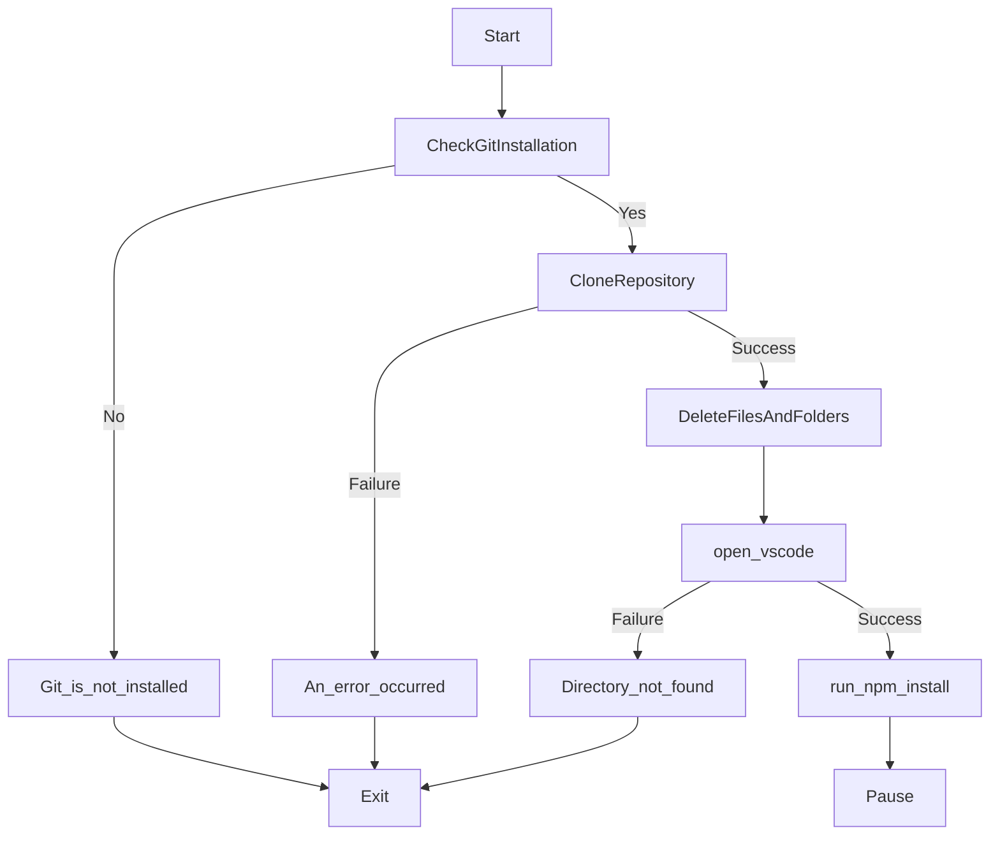

# Sandbox environment Automation

1. This is a Custom Template used for Node js + React Empty Sandbox Environment For Automation Project.
2. It has a basic Backend Setup in `node js` and frontend setup in `React`.
3. It can be used for testing any new feature in a completely `isolated` and already setup environment.
4. I am including Backend env because it doens't have anything important.

## How to Use :

1. Just Download the `automate.bat` (nothing else from the repo).
2. open it with notepad.
3. Change the value of `clone_directory` on `line 5` to your desired directory where  you want to get the sandbox environment setup.
4. Run the `automate.bat` file.

## How Does Automation Work ? (Overview)

## What does the sandbox testing environment has?

#### Node Backend

1. Pre-installed and already setup npm packages - 
   
   1. `body-parser`
   
   2. `cookie-parser`
   
   3. `cors`
   
   4. `dotenv`
   
   5. `express`

2. Already Setup `app.js` and `Index.js` in Backend/src.

3. Already setup .env with -
   
   1. `PORT=8080`
   
   2. `CORS_ORIGIN=*`

4. Start Command - `node Backend/src/index.js` 

## React Frontend

1. Already removed usless react `Boilerplate Code`

2. Have a basic `HI` return from `App component`.

3. Starts on `port 3000`.

4. Start Command - 
   
   1. `cd Frontend`
   
   2. `npm start`