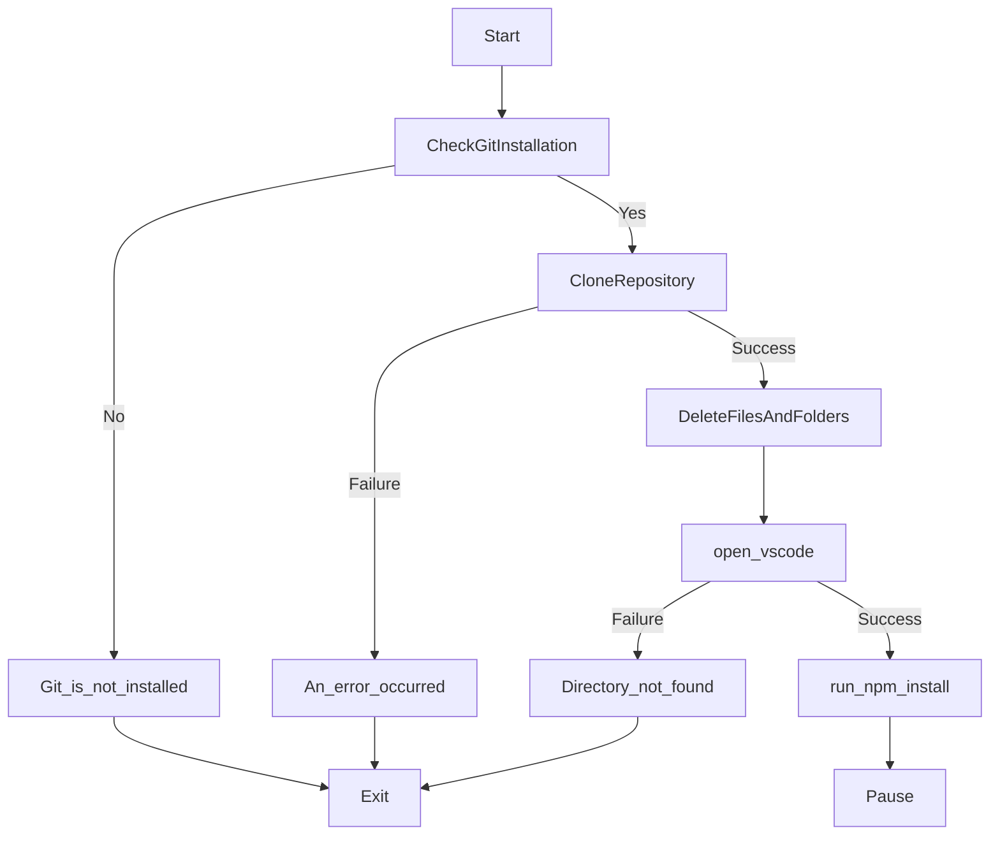

# Sandbox environment Automation

1. This is a Custom Template used for Node js + React Empty Environment Simulation Automation Project.
2. It has a basic Backend Setup in `node js` and frontend setup in `React`.
3. I am including Backend env because it doens't have anything important.

## How to Use :

1. Just Download the `automate.bat` (nothing else from the repo).
2. open it with notepad.
3. Change the value of `clone_directory` on `line 5` to your desired directory where  you want to get the sandbox environment setup.
4. Run the `automate.bat` file.

## How Does it Work ? (Overview)

Flowchart

